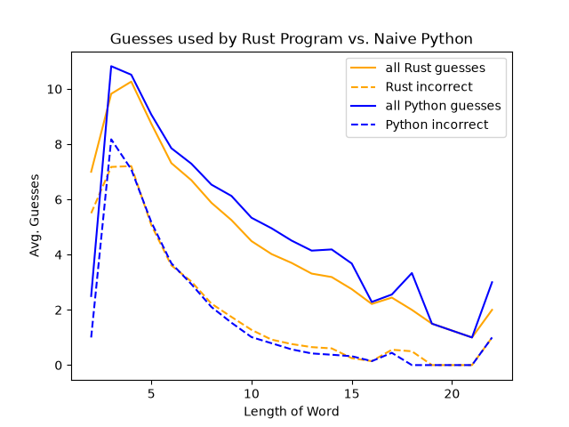

# HangStop - A Blazingly-Fast Command-Line Tool for Suggesting Hangman Guesses

## Overview
HangStop is a Rust CLI tool that indicates which letter would be the most informative
guess in a game of Hangman. The partially-revealed word is described using `?`s for 
the hidden letters. Incorrect letters from previous guesses can be specified using
the `-i` flag. For example:
```bash
$ hangstop "?la???g" -i "es"
Best letters to guess:
b: 0.896 bits
f: 0.896 bits
c: 0.868 bits
p: 0.811 bits
w: 0.696 bits
y: 0.696 bits
m: 0.544 bits
r: 0.544 bits
d: 0.337 bits
k: 0.337 bits
n: 0.337 bits
t: 0.337 bits
z: 0.337 bits
h: 0.000 bits
i: 0.000 bits
j: 0.000 bits
o: 0.000 bits
q: 0.000 bits
u: 0.000 bits
v: 0.000 bits
x: 0.000 bits
16 possible words remaining
```

HangStop reveals the full word as soon as it has enough information, even if there
are still letters to be guessed:
```bash
$ hangstop "bla???g" -i "esdmrw"
The mystery word must be 'blazing'.
```

Since HangStop uses a very comprehensive wordlist (for robustness), some of the
remaining words may be unlikely candidates for the secret word. You can use 
`-l` to view the remaining words and make human decisions that are difficult
to automate:
```bash
$ hangstop "?la???g" -i "es" -l
placing
plating
blaming
planing
flaking
flawing
flaring
flaming
blaring
flaying
clawing
blawing
playing
blading
claying
blazing
16 possible words remaining
```

Important data is cleanly separated from logging and other messages so that
data can be cleanly dumped or piped into other commands:

```bash
$ hangstop "?la???g" -i "es" -l | rg "ay"
16 possible words remaining
playing
claying
flaying
```

## Implementation details
HangStop uses Shannon entropy to determine which letter to guess next:


Here, 'H' is the entropy, while 'n' is the total number of ways a given letter 
can uncover spaces in the secret word. 'x_i' is one of those possible uncoverings,
and 'p(x_i)' is the probability that that uncovering will occur. Essentially,
the entropy is a weighted average of all of the possible amounts of information
a given letter can uncover. 

Hangstop calculates this entropy for every letter and thus determines which
letters are likely to yield the most information.

## About the Predecessor
HangStop is a Rust rewrite of an old project called [HangStopper](https://github.com/bad-indentation/HangStopper).
HangStopper was written in Python, featured a rather ugly GUI, and used a simple
but effective strategy: Count the occurences of each letter in the remaining words;
the letter with the highest count is the next guess. The goal of the rewrite 
here was to determine whether a little bit of information theory could beat an 
already very effective algorithm. The results are summed up well by this graph:



As one can see, HangStop generally uses less guesses overall than HangStopper,
albeit sometimes at the cost of incurring more wrong guesses. The distinction,
then, is that HangStop plays the game *quickly*, while HangStopper, the original,
plays it *safely*. We leave it to the user to decide which is more suitable for
their Hangman purposes.

Some other versions of the algorithm were tried. Curious users are encouraged
to visit the `benchmark_data/` directory of the repo, where we have included some 
informative CSVs:

| File Name             | Description                       |
| ----------            | ----------                        | 
| python.csv            | Performance data for original Python program |
| rust.csv              | Performace data for current implementation |
| rust_1b_penalty.csv   | States where the given letter is not present are assumed to give one less bit of information than they actually do |
| rust_2b_penalty.csv   | States where the given letter is not present are assumed to give two less bits of information than they actually do |
| rust_3b_penalty.csv   | States where the given letter is not present are assumed to give three less bits of information than they actually do |
| rust_misses_0b.csv    | States where the given letter is not present are assumed to give 0 bits of information | 

Some of the other iterations performed marginally better in certain cases, but
we ultimately opted for the simple Shannon entropy calculation to emphasize
transparency and stability.

## Installation
```bash
cargo install hangstop
```

## License
HangStop is licensed under the MIT license. This means that you are free to 
install, modify, and distribute this code as long as you include the license 
text in your derivative. For more information, see LICENSE.txt.

## Note
HangStop uses a very extensive dictionary. As such, it may output obscure, 
profane, or offensive words for certain inputs.

## Acknowledgements
HangStop uses a wordlist found in the repo `wordnik/wordlist`. You can find its
license information in wordlist-license.txt.

